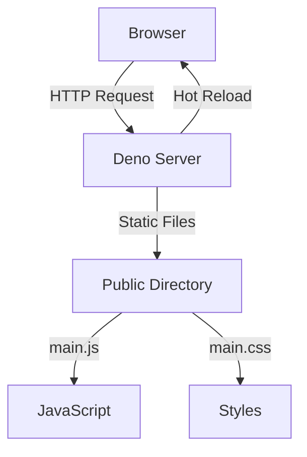
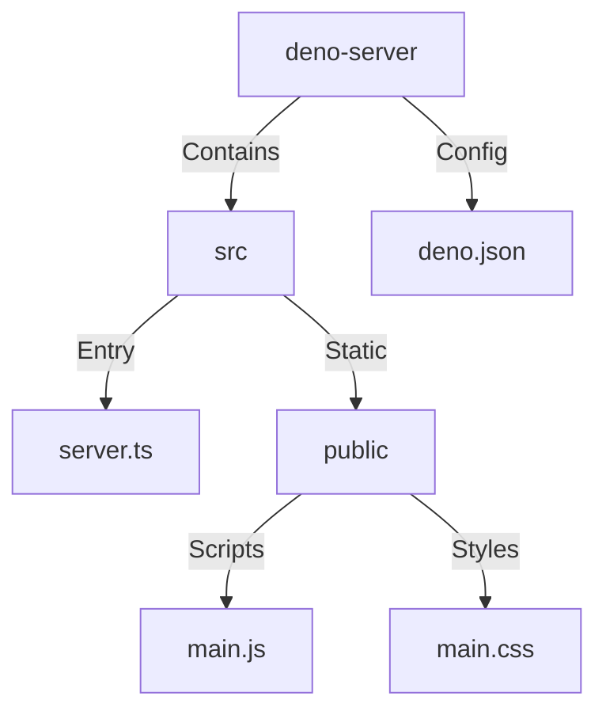
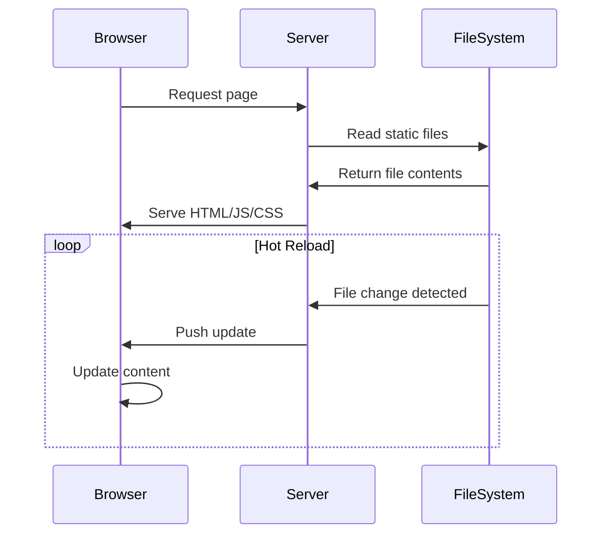

# Deno Baseline Server

A modern Deno server implementation with hot reloading capabilities and strict
TypeScript configuration.

## Architecture

<details>
<summary>View Architecture Diagram</summary>



</details>

## Project Structure

<details>
<summary>View Project Structure Diagram</summary>



</details>

## Features

- Hot module reloading
- Static file serving
- TypeScript support
- Strict type checking
- Development mode with watch
- Formatting and linting built-in

## Configuration

The project uses `deno.json` for configuration with the following features:

```json
{
  "compilerOptions": {
    "lib": ["deno.window"],
    "strict": true
  }
}
```

## Available Scripts

- `deno task dev` - Run in development mode with hot reloading
- `deno task start` - Run in production mode
- `deno task test` - Run tests
- `deno task lint` - Lint code
- `deno task fmt` - Format code

## Getting Started

1. Install Deno:
   ```bash
   curl -fsSL https://deno.land/x/install/install.sh | sh
   ```

2. Run the development server:
   ```bash
   deno task dev
   ```

3. Access the server at `http://localhost:8000`

## Development Flow

<details>
<summary>View Development Flow Diagram</summary>



</details>

## Requirements

- Deno 2.2 or higher
- Modern browser (for development)

## License

MIT
