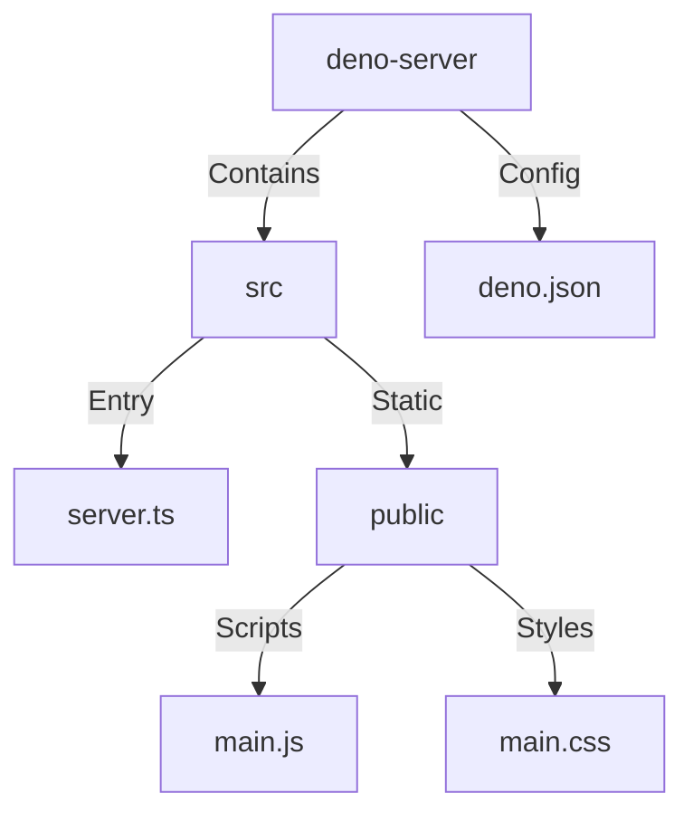
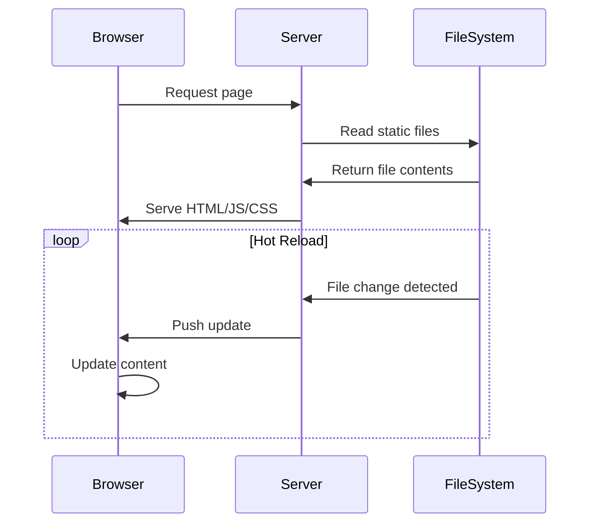

# Deno & Custom Elements

With so many exciting new web platform features being adopted this site aims to combine as many possible together to see what tomorrow's build may look like.

## Web Platform Features Used

| Feature | Type | Description | Implementation |
|---------|------|-------------|----------------|
| **CSS Anchor Positioning** | CSS | Position elements relative to other elements using `anchor()` | Used in nav popovers with `anchor-name` and `position-anchor` |
| **CSS View Transitions** | CSS/JS | Smooth transitions between DOM states using `document.startViewTransition()` | Page navigation with custom transition types and performance optimization |
| **CSS Paint API (Houdini)** | CSS/JS | Custom paint functions with `paint()` and `registerPaint()` | Grid patterns in worklets for background images |
| **CSS Properties & Values API** | CSS/JS | Register custom CSS properties with `CSS.registerProperty()` | Type-safe custom properties with syntax validation |
| **CSS Typed Object Model** | JS | Typed CSS values instead of strings using `attributeStyleMap` | Performance-optimized style manipulation |
| **Custom Elements** | JS | Define custom HTML elements with `customElements.define()` | Web components for feature cards and navigation |
| **Popover API** | HTML/JS | Native popover behavior with `popover` attribute | Mobile navigation and feature detection dialogs |
| **CSS Container Queries** | CSS | Style queries with `@container style()` | Code syntax highlighting based on language |
| **CSS Functions** | CSS | Custom CSS functions with `@function` | Layout utilities, media queries, and design tokens |
| **CSS Scope** | CSS | Scoped styles with `@scope` | Component-level styling isolation |
| **CSS Values Level 5** | CSS | Math functions like `calc-size()`, `round()` | Responsive sizing and grid calculations |
| **CSS Mixins** | CSS | Reusable style blocks with custom properties | Theme variables and component styling |
| **field-sizing** | CSS | Content-based form sizing | Auto-resizing inputs and textareas |
| **corner-shape** | CSS | Alternative border shapes like `notch` | Custom icon styling |
| **View Transition Names** | CSS | Named transitions with `view-transition-name` | Coordinated page animations |
| **Performance Observer** | JS | Monitor web performance metrics | Adaptive animations based on device capabilities |
| **CSS Paint Worklets** | JS | Background generation in separate thread | Grid and pattern generation |
| **Speculation Rules** | HTML | Prefetch and prerender hints | Performance optimization for navigation |

## Project Structure

<details>
<summary>View Project Structure Diagram</summary>



</details>

## Features

- Hot module reloading
- Static file serving
- TypeScript support
- Strict type checking
- Development mode with watch
- Formatting and linting built-in

## Configuration

The project uses `deno.json` for configuration with the following features:

```json
{
  "compilerOptions": {
    "lib": ["deno.window"],
    "strict": true
  }
}
```

## Available Scripts

- `deno task dev` - Run in development mode with hot reloading
- `deno task start` - Run in production mode
- `deno task test` - Run tests
- `deno task lint` - Lint code
- `deno task fmt` - Format code

## Getting Started

1. Install Deno:
   ```bash
   curl -fsSL https://deno.land/x/install/install.sh | sh
   ```

2. Run the development server:
   ```bash
   deno task dev
   ```

3. Access the server at `http://localhost:8000`

## Development Flow

<details>
<summary>View Development Flow Diagram</summary>



</details>

## Requirements

- Deno 2.2 or higher
- Modern browser (for development)

## License

MIT
